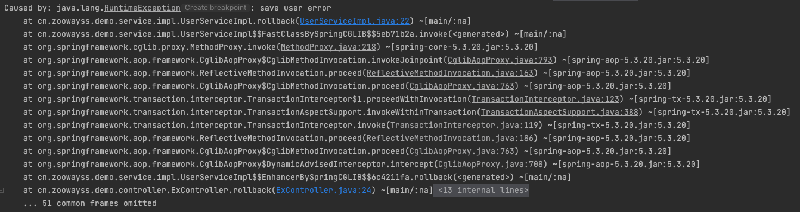
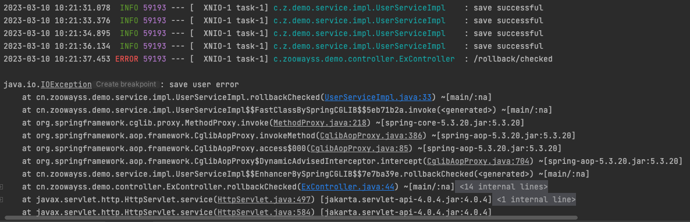
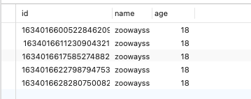
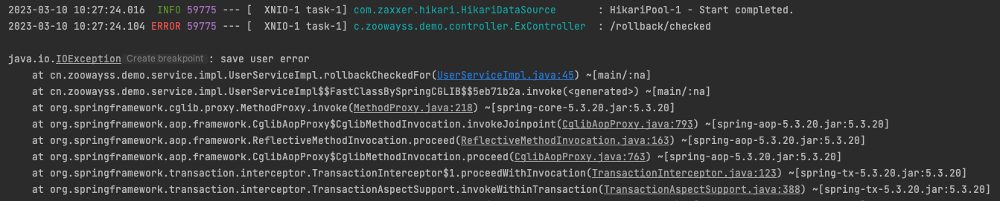

# 关于spring @Transaction

## 异常处理

- 默认情况下，业务方法抛出 unckecked Exception 

  ```shell
  curl http://localhost:8080/tx/ex/rollback/unchecked
  ```

  

  能够正确捕获异常，并进行回滚

- 默认情况下，业务方法抛出 checked Exception 

  ```shell
  curl http://localhost:8080/tx/ex/rollback/checked
  ```

  

  

  成功的记录数4，异常数1，但是数据库却有5条数据，说明对于 checked 异常，并不能回滚

- @Transactional(rollbackFor = Exception.class)  业务方法抛出 checked Exception 

  ```shell
  curl http://localhost:8080/tx/ex/rollback/checked/for
  ```

  

  出现了异常，但是能够正确回滚