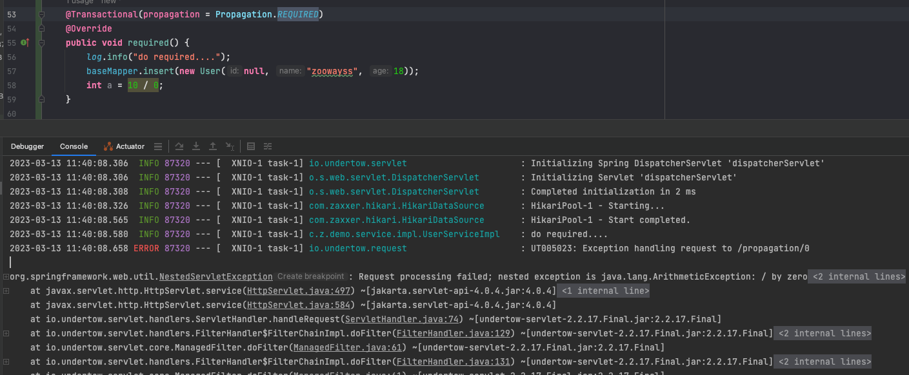

# 关于spring @Transaction

## 异常处理

- 默认情况下，业务方法抛出 unckecked Exception 

  ```shell
  curl http://localhost:8080/tx/ex/rollback/unchecked
  ```

  

  能够正确捕获异常，并进行回滚

- 默认情况下，业务方法抛出 checked Exception 

  ```shell
  curl http://localhost:8080/tx/ex/rollback/checked
  ```

  

  

  成功的记录数4，异常数1，但是数据库却有5条数据，说明对于 checked 异常，并不能回滚

- @Transactional(rollbackFor = Exception.class)  业务方法抛出 checked Exception 

  ```shell
  curl http://localhost:8080/tx/ex/rollback/checked/for
  ```

  

  出现了异常，但是能够正确回滚

## 传播行为

see org.springframework.transaction.annotation.Propagation

- REQUIRED

  Support a current transaction, create a new one if none exists. 
  
  ```shell
curl http://localhost:8080/tx/propagation/0
  ```

  

  出现了异常，数据回滚

- SUPPORTS

  Support a current transaction, execute non-transactionally if none exists.

  出现了异常，确实以非事物的方式运行，所以数据插入成功，并不会回滚

- MANDATORY

  Support a current transaction, throw an exception if none exists. 

  如果当前不存在事物，会抛出 **org.springframework.transaction.IllegalTransactionStateException**

  并进行回滚

- REQUIRES_NEW

  Create a new transaction, and suspend the current transaction if one exists. 

  ```java
  @Service()
  public class AClass {
  
      private BClass bClass;
  
      @Autowired
      public void setbClass(BClass bClass) {
          this.bClass = bClass;
      }
  
      @Transactional(rollbackFor = Exception.class)
      public void aFunction() {
          //todo: 数据库操作A(增，删，该)
          try {
              bClass.bFunction();
          } catch (Exception e) {
              e.printStackTrace();
          }
      }
  
  }
  
  @Service()
  public class BClass {
  
      @Transactional(rollbackFor = Exception.class)
      public void bFunction() {
          //todo: 数据库操作A(增，删，该)
          throw new RuntimeException("函数执行有异常!");
      }
  }
  ```

  结果：两个函数数据库操作都没成功。而且还抛异常了。org.springframework.transaction.UnexpectedRollbackException: Transaction rolled back because it has been marked as rollback-only。看打印出来的解释也很好理解把。咱们也可以这么理解，两个函数用的是同一个事务。bFunction函数抛了异常，调了事务的rollback函数。事务被标记了只能rollback了。程序继续执行，aFunction函数里面把异常给抓出来了，这个时候aFunction函数没有抛出异常，既然你没有异常那事务就需要提交，会调事务的commit函数。而之前已经标记了事务只能rollback-only(以为是同一个事务)。直接就抛异常了，不让调了。

  ----------

  ```java
  @Service()
  public class AClass {
  
      private BClass bClass;
  
      @Autowired
      public void setbClass(BClass bClass) {
          this.bClass = bClass;
      }
  
      @Transactional(rollbackFor = Exception.class)
      public void aFunction() {
          //todo: 数据库操作A(增，删，该)
          try {
              bClass.bFunction();
          } catch (Exception e) {
              e.printStackTrace();
          }
      }
  
  }
  
  @Service()
  public class BClass {
  
      @Transactional(propagation = Propagation.REQUIRES_NEW, rollbackFor = Exception.class)
      public void bFunction() {
          //todo: 数据库操作A(增，删，该)
          throw new RuntimeException("函数执行有异常!");
      }
  }
  ```

  结果：bFunction函数里面的操作回滚了，aFunction里面的操作成功了。有了前面情况2的理解。这种情况也很好解释。两个函数不是同一个事务了。